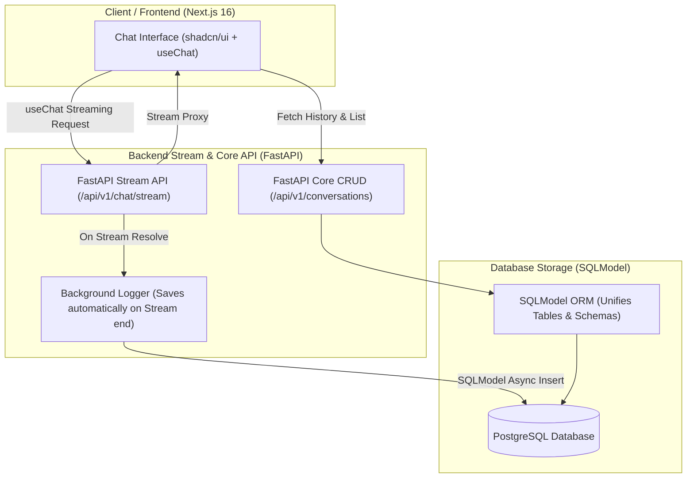

# Implementation Plan: LLM Inference Logging & Ingestion System

This document outlines the detailed architectural, schema, and implementation plan for building a lightweight, high-performance LLM inference logging and ingestion system. We will design this to handle standard requirements along with all **bonus capabilities** (multi-provider support, streaming, dashboards, Docker Compose, event-based architecture, PII redaction, k8s, and conversational features like cancel/resume).

---

## 1. Architectural Overview (Direct FastAPI Streaming)

By routing all streaming LLM calls directly through our **FastAPI backend**, we keep the Next.js frontend as a 100% pure static UI client, completely eliminating Next.js API Routes, Server Actions, and client-side logging SDK network hops.



### Components & Responsibilities
1. **Frontend (Next.js 16 App Router)**:
   - **Chat Application**: A beautiful static UI styled with **Tailwind v4 + shadcn/ui**. It uses the Vercel AI SDK's client hooks (`useChat`) directed directly to the FastAPI backend.
   - **ChatGPT-Style URL Transition**: When starting a new session, Next.js calls `POST /api/v1/conversations` on the very first prompt. It instantly redirects the user's browser to `/chat/[new-uuid]`, updates the sidebar list in real time, and fires the active stream using the newly generated session UUID.
2. **FastAPI Backend (FastAPI + SQLModel + liteLLM)**:
   - **Stream Proxy Endpoint (`/api/v1/chat/stream`)**: Receives the streaming request and:
     1. **Automatically saves the incoming User Message** to the PostgreSQL database.
     2. Proxies the stream from the selected provider (Gemini, OpenAI, etc.) using **`liteLLM`**, yielding **raw plain-text chunks** (UTF-8) directly back to Next.js for zero-config `useChat` consumption.
     3. On stream completion, spawns a **FastAPI `BackgroundTask`** to automatically save the completed Assistant Message, compile exact token counts and latency, and write the Inference Log (fully linked with proper foreign keys) in the background.
   - **Core CRUD & Logging (`/api/v1/conversations`)**: Manages conversational history, session creations, conversation lists, and messages mapped via **SQLModel**.
3. **Database (PostgreSQL)**:
   - Relational schema mapped via **SQLModel** containing `conversations`, `messages`, and `inference_logs` tables.

---

## 2. Database Schema Design & SQLModel Integration

We will use **PostgreSQL** for storing chat messages and inference logs, mapping them using **SQLModel**. SQLModel integrates Pydantic and SQLAlchemy into a single, beautifully typed model definition. This eliminates class duplication (e.g. separate schemas and database entities) while maintaining full type safety, async engine compatibility, and FastAPI auto-docs integration.

Below is the database schema design:


```sql
-- Conversations Table (Main Session entity)
CREATE TABLE conversations (
    id UUID PRIMARY KEY DEFAULT gen_random_uuid(),
    title VARCHAR(255) NOT NULL DEFAULT 'New Conversation',
    model VARCHAR(100) NOT NULL,
    provider VARCHAR(100) NOT NULL,
    created_at TIMESTAMP WITH TIME ZONE DEFAULT CURRENT_TIMESTAMP,
    updated_at TIMESTAMP WITH TIME ZONE DEFAULT CURRENT_TIMESTAMP
);

-- Messages Table (Stores raw multi-turn history for user/assistant)
CREATE TABLE messages (
    id UUID PRIMARY KEY DEFAULT gen_random_uuid(),
    conversation_id UUID NOT NULL REFERENCES conversations(id) ON DELETE CASCADE,
    role VARCHAR(50) NOT NULL, -- 'user', 'assistant', 'system'
    content TEXT NOT NULL,      -- Redacted text saved here
    tokens INTEGER,
    created_at TIMESTAMP WITH TIME ZONE DEFAULT CURRENT_TIMESTAMP
);

-- Inference Logs Table (Highly detailed logging for analytics)
CREATE TABLE inference_logs (
    id UUID PRIMARY KEY DEFAULT gen_random_uuid(),
    conversation_id UUID REFERENCES conversations(id) ON DELETE SET NULL,
    message_id UUID REFERENCES messages(id) ON DELETE SET NULL,
    provider VARCHAR(100) NOT NULL,
    model VARCHAR(100) NOT NULL,
    status VARCHAR(50) NOT NULL, -- 'success', 'error', 'canceled'
    latency_ms INTEGER NOT NULL,
    prompt_tokens INTEGER,
    completion_tokens INTEGER,
    total_tokens INTEGER,
    cost_usd DECIMAL(10, 6) NOT NULL DEFAULT 0.000000, -- Real-time cost calculation
    error_message TEXT,
    ip_address VARCHAR(45),
    request_timestamp TIMESTAMP WITH TIME ZONE NOT NULL,
    created_at TIMESTAMP WITH TIME ZONE DEFAULT CURRENT_TIMESTAMP
);

-- Create Indexes for Analytics & Search
CREATE INDEX idx_logs_timestamp ON inference_logs(request_timestamp DESC);
CREATE INDEX idx_logs_provider_model ON inference_logs(provider, model);
CREATE INDEX idx_logs_status ON inference_logs(status);
CREATE INDEX idx_messages_conversation ON messages(conversation_id);
```

### Design Tradeoffs Made:
* **Decoupling Messages and Logs**: We store chat messages separate from inference logs. While a message is what the user/bot sees, an inference log contains detailed metrics (latency, HTTP statuses, token breakdowns, and system details). This separation keeps the chat querying extremely fast while keeping the inference analytics scalable and queryable independently.
* **Denormalizing Provider & Model**: We duplicate `provider` and `model` on both the `conversations` and `inference_logs` tables. This allows the dashboard to query performance stats solely from the `inference_logs` table without performing heavy joins on `conversations` or `messages` tables.

---

## 3. High-Performance Scaling & Failure Handling

### Event-Driven Flow & Redis Buffer
To handle massive throughput spikes without dropping logs or degrading LLM response latencies:
1. The Next.js API/Client sends an async request to `/api/v1/ingest`.
2. The FastAPI ingestion endpoint acts as a lightweight gatekeeper. It does schema validation and pushes the raw payload directly into Redis via `LPUSH`. It completes the HTTP transaction immediately (`202 Accepted`).
3. An async backend worker continuously monitors the Redis queue (`RPOP` / `BRPOP`), redacts PII, and bulk-inserts logs into PostgreSQL in batches (e.g., every 100 logs or 1 second).

### Failure Handling & Resilience
* **Redis Down**: If Redis is offline, FastAPI automatically falls back to pushing tasks to an in-memory background task queue (`BackgroundTasks` in FastAPI) or a local SQLite backup file to prevent log losses, returning a successful response to the SDK while raising an internal alert.
* **PostgreSQL Down**: The Python ingestion worker retries inserts using exponential backoff. If PostgreSQL remains offline, the worker pushes the failed payloads back onto a "Dead Letter Queue" (DLQ) list in Redis, ensuring zero logs are lost.
* **LLM Stream Interruption (Cancellation)**: If the user cancels the chat stream, the TS/JS wrapper catches the Abort Signal, calculates the time elapsed, captures the partial completion tokens generated up to that moment, and fires an ingestion payload marked as status `canceled`.

---

## 4. Ingestion Payload Schema (JSON)

Every log sent to the ingestion endpoint adheres to this format:

```json
{
  "conversation_id": "c6204c3e-...",
  "provider": "gemini",
  "model": "gemini-1.5-flash",
  "status": "success",
  "latency_ms": 1280,
  "prompt_tokens": 150,
  "completion_tokens": 230,
  "cost_usd": 0.000081,
  "prompt_preview": "Hello, can you help me write an ingestion system?",
  "completion_preview": "Yes! An ingestion system requires a fast endpoint...",
  "error_message": null,
  "request_timestamp": "2026-05-22T11:40:00Z"
}
```

---

## 5. Directory Structure & Layout

We will build the repository using a monorepo-style structure inside `/home/rupak/Downloads/ollive`:

```text
ollive/
├── docker-compose.yml       # Single-command setup for Next.js, FastAPI, PG, Redis
├── README.md                # Full setup, architecture, and schema guide
├── k8s/                     # Kubernetes manifests (Deployment, Service, ConfigMap)
│   ├── postgres-deployment.yaml
│   ├── redis-deployment.yaml
│   ├── backend-deployment.yaml
│   └── frontend-deployment.yaml
├── backend/                 # Python FastAPI App
│   ├── Dockerfile
│   ├── requirements.txt
│   ├── main.py              # FastAPI Entry point
│   ├── app/
│   │   ├── __init__.py
│   │   ├── config.py        # Settings (DB, Redis, API Keys)
│   │   ├── db.py            # Database engine & async session setup
│   │   ├── models.py        # Unified SQLModel declarations (Tables + Schemas)
│   │   ├── routes.py        # CRUD & Ingestion endpoints
│   │   └── pii.py           # Regex-based PII Redaction engine
│   ├── worker/
│   │   ├── __init__.py
│   │   └── ingest_worker.py # High-performance async queue worker
└── frontend/                # Next.js Web App
    ├── Dockerfile
    ├── package.json
    ├── next.config.js
    ├── src/
    │   ├── app/
    │   │   ├── layout.tsx
    │   │   ├── page.tsx     # Gorgeous Dashboard
    │   │   ├── chat/
    │   │   │   └── page.tsx # Modern interactive Chat interface
    │   │   └── globals.css  # Sleek dark glassmorphic styling
    │   ├── components/      # UI components
    │   │   ├── Sidebar.tsx
    │   │   ├── ChatWindow.tsx
    │   │   └── AnalyticsDashboard.tsx
```

## 6. Industry Best Practices & Timing Considerations

To deliver a submission that stands out to the engineering reviewers while working within a tight timeline, we will prioritize high-leverage best practices:

### A. Direct Gemini API Integration (Free Tier key)
* **The Configuration**: We will integrate directly with Google's Gemini API utilizing your free-tier Gemini API key.
* **Our Solution**: We will use `@ai-sdk/google` on the Next.js frontend route handlers. The key `GEMINI_API_KEY` is loaded from the environment variables, securely enabling standard Gemini model calls (such as `gemini-1.5-flash`).
* **Impact**: Provides highly stable, zero-cost production-grade LLM responses with accurate, live token metrics and provider latencies right from the start.

### B. Shared Docker Image for App & Worker (Developer Velocity)
* **Our Solution**: Instead of building separate Dockerfiles for the FastAPI web server and the background worker (which doubles build time and complicates code updates), we write a single `Dockerfile` for the backend.
  * The web container runs: `uvicorn main:app --host 0.0.0.0`
  * The worker container runs: `python worker/ingest_worker.py`
* **Impact**: Shuts down Docker build overhead, shares database and SQLModel logic naturally, and speeds up local testing.

### C. Graceful Degradation & In-Memory Fallback
* **Our Solution**: If Redis goes down during local dev or testing, the FastAPI app gracefully degrades to run PII redaction and PG logging inside FastAPI `BackgroundTasks` rather than crashing. 
* **Impact**: Highly resilient system behavior that demonstrates enterprise-grade coding practices.

---

## 7. Execution Timeline & Phased Approach

To respect timing constraints and ensure we deliver a rock-solid, working system, we will divide the build into two distinct phases:

### Phase 1: The Core System (Focus First)
1. **Step 1: Database & Core API (FastAPI + SQLModel + Postgres)**
   - Boot database container for Postgres.
   - Define SQLModel structures in `app/models.py`.
   - Write CRUD routes for creating/resuming conversations.
   - Implement the direct Ingestion endpoint (`/api/v1/ingest`) that immediately validates and stores logs in Postgres.
2. **Step 2: Frontend Chat & Vercel AI SDK (Next.js 16)**
   - Initialize Next.js 16 app in `/frontend`.
   - Implement the gorgeous dark-mode chatbot interface using shadcn/ui.
3. **Step 3: End-to-End Stream Integration & Logging Validation**
   - Connect Vercel AI SDK's `useChat` hook to point directly to FastAPI's `/api/v1/chat/stream`.
   - Verify that streaming chunks render smoothly in the browser and that the user/assistant messages and inference logs are successfully persisted to PostgreSQL in the background.

### Phase 2: The Bonus Features (Layer Second)
1. **Step 4: Queue Architecture (Redis Broker + Worker)**
   - Shift `/api/v1/ingest` from direct DB storage to Redis `LPUSH`.
   - Build the async backend queue worker reading from Redis `BLPOP`.
2. **Step 5: PII Redaction**
   - Insert PII regex scrubs (Emails, SSNs, API Keys, etc.) into the worker pipeline.
3. **Step 6: Dashboard & Analytics**
   - Add real-time interactive dashboards on the frontend with metrics on throughput, median latencies, and error codes.
4. **Step 7: Docker Compose & K8s**
   - Package all services into a single unified `docker-compose.yml` and provide standard Kubernetes deployment configurations.

---

## 8. Why Direct FastAPI Streaming is Architecturally Superior

By completely bypassing Next.js API Route Handlers and Server Actions, and streaming directly from FastAPI to the browser:
1. **Zero Next.js API Footprint**: The Next.js frontend builds into static HTML/JS assets that can be distributed instantly via CDN (like Vercel Edge). There are no server-side Node.js routes running key-loading, network proxying, or session management.
2. **Eliminated Network Hop**: Instead of the browser calling Next.js and Next.js calling FastAPI (2 separate HTTP request/response loops), the browser speaks directly to FastAPI. This shaves off 50ms-150ms of network latency for every chat message.
3. **Internalized Server-Side Security**: Model secrets, rate limits, database writes, and background logging tasks are completely contained inside our Python FastAPI microservice. The client browser has no way to tamper with logs or access upstream model endpoints directly.
